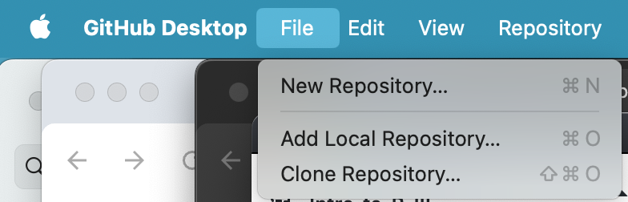
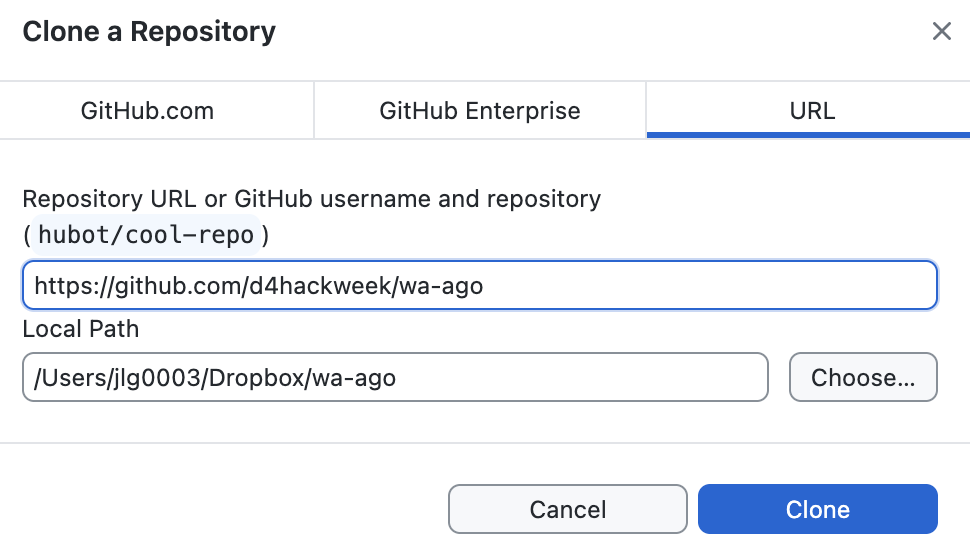

# GitHub Guide & Resources 

## Getting your GitHub Account

  1. Click on this icon [https://github.com/](https://github.com/) and select Sign Up in the top right corner.   
  2. Set up your account and log in.
  3. Email [csde-prgm-coord@uw.edu](mailto:csde-prgm-coord@uw.edu) when you’ve gotten to this step and we will add you to your repository.

## Downloading GitHub Desktop

  1.  Navigate to [https://desktop.github.com/download/](https://desktop.github.com/download/) and download the appropriate version for your machine.
  2.  Open GitHub Desktop and follow these [instructions](https://docs.github.com/en/desktop/installing-and-authenticating-to-github-desktop/setting-up-github-desktop) to link your GitHub Desktop to your GitHub account (Part 2) and to configure Git (Part 3).

## Cloning the Repository

  1. Navigate to your team’s GitHub repository on GitHub.com and copy the repository URL.
  2. Click the File Menu in GitHub Desktop & select "Clone Repository...".
     File > Clone Repository...
     
  3. Select URL from the pop-up window and paste the repository URL into the URL field.
     Navigate in the Local Path field to the place on your computer you’d like the repository files to live and click Clone.
     
  4. On your computer, use your file browser to navigate to the folder into which you cloned the repository and find your files there!

## Resources

**LOI Templates and Guidance**
  *  [LOI and Proposal Writing Tips | Russell Sage Foundation](https://urldefense.com/v3/__https:/www.russellsage.org/apply/grants/core/loi-proposal__;!!K-Hz7m0Vt54!iiqh611bPnBirkQDatmVbS4pT6uQ-Ya-Np9BN4B66JAsKMjFQkd_Ei719bpOAMdDJayzzqDKwBN4ftDdZbz--8NerA$)
  *  [Arnold Ventures LOI template](https://urldefense.com/v3/__https:/view.officeapps.live.com/op/view.aspx?src=https*3A*2F*2Fav-prod.atl1.cdn.digitaloceanspaces.com*2Fuploads*2FPDFs*2FAV_LOI_Template.docx&wdOrigin=BROWSELINK__;JSUlJSUl!!K-Hz7m0Vt54!iiqh611bPnBirkQDatmVbS4pT6uQ-Ya-Np9BN4B66JAsKMjFQkd_Ei719bpOAMdDJayzzqDKwBN4ftDdZbzIOI5Kvg$)
  *  [Institute for Advanced Study LOI Guidance](https://urldefense.com/v3/__https:/www.ias.edu/sites/default/files/media-assets/Guidance*20Doc_LOI.docx.pdf__;JQ!!K-Hz7m0Vt54!iiqh611bPnBirkQDatmVbS4pT6uQ-Ya-Np9BN4B66JAsKMjFQkd_Ei719bpOAMdDJayzzqDKwBN4ftDdZbxk66m1VQ$)
  *  [Sloan Foundation LOI Guidance](https://urldefense.com/v3/__https:/sloan.org/grants/apply*tab-letters-of-inquiry__;Iw!!K-Hz7m0Vt54!iiqh611bPnBirkQDatmVbS4pT6uQ-Ya-Np9BN4B66JAsKMjFQkd_Ei719bpOAMdDJayzzqDKwBN4ftDdZbzPmZx8ow$)
  *  [Doris Duke Foundantion LOI Guidance](https://urldefense.com/v3/__https:/www.dorisduke.org/grants/letter-of-inquiry__;!!K-Hz7m0Vt54!iiqh611bPnBirkQDatmVbS4pT6uQ-Ya-Np9BN4B66JAsKMjFQkd_Ei719bpOAMdDJayzzqDKwBN4ftDdZbwF850QFA$)
  *  [Glenn W. Bailey Foundation Loi Guidance](https://urldefense.com/v3/__https:/www.gwbaileyfoundation.org/loi__;!!K-Hz7m0Vt54!iiqh611bPnBirkQDatmVbS4pT6uQ-Ya-Np9BN4B66JAsKMjFQkd_Ei719bpOAMdDJayzzqDKwBN4ftDdZbz-oDoFdw$)

**Helpful Tools to Complete your LOI (on GitHub)**
  *  For your team to get clearer on the Why and How of your research project:
     * Concept Map. Explains the proposed or probable answers to the question and anticipates organized skepticism about it; table that lays out the concepts how they are measured and the data sources (with type of requirements for getting those data - accessing admin data, existing free secondary data, original survey or observational data.
  * For your team to unpack the How of your research:
     * Data Collection Plan. Worksheet for measures, data, and analyze
  * For your team to think through the When (flow and timing) of your project:
     * GANTT Chart. Lays out who does what when - this will also help with scoping the project; Helps with producing an LOI Timeline
