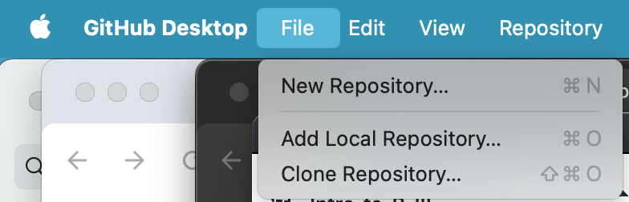
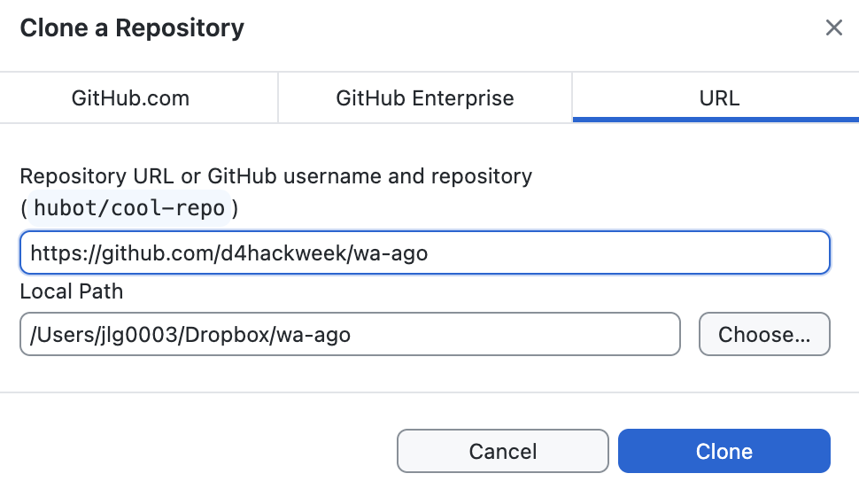
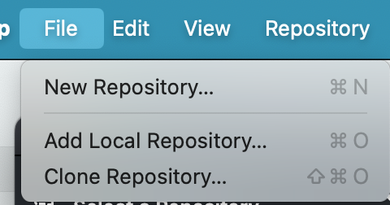
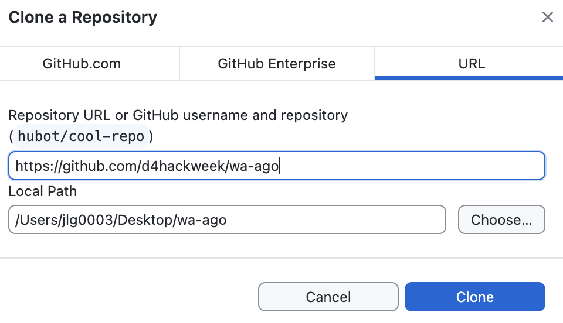
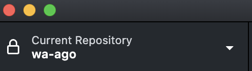
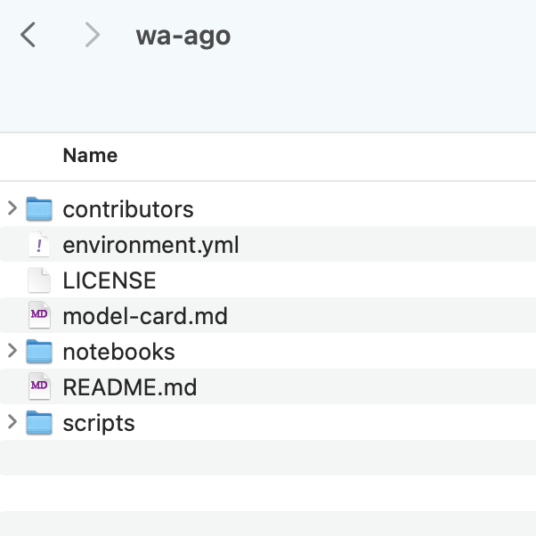
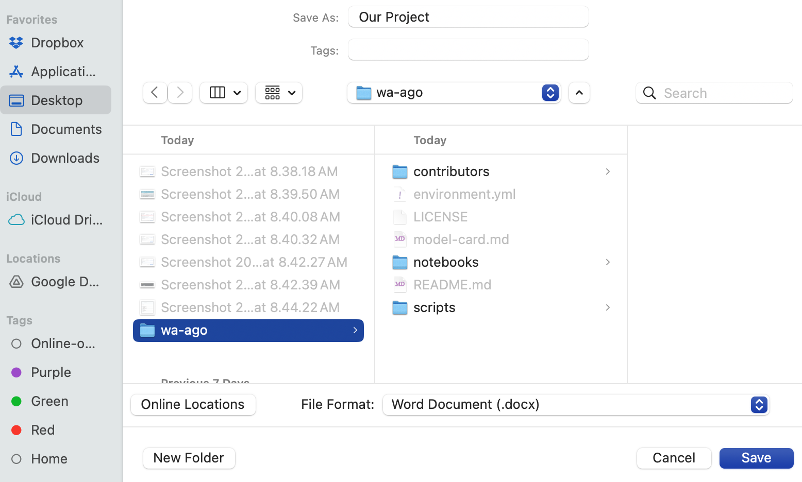
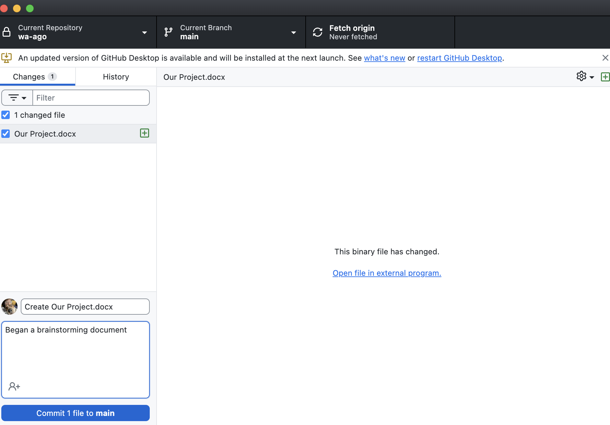

# GitHub Guide, Resources, & LOIs

## Getting your GitHub Account

  1. Click on this icon [https://github.com/](https://github.com/) and select Sign Up in the top right corner.   . We recommend doing these steps on a laptop. 
  2. Set up your account and log in. Please remember the username and password that you set-up.
  3. GitHub will send you an email with a "launch code" for authentification 
  4. Email [csde-prgm-coord@uw.edu](mailto:csde-prgm-coord@uw.edu) when you’ve gotten to this step and we will add you to your team's repository.
  5. You will receive an email from GitHub saying that "maddiefarris invited you to join...", please click on that invitation to access your team's repository. 

## Downloading GitHub Desktop

  1.  Navigate to [https://desktop.github.com/download/](https://desktop.github.com/download/) and download the appropriate version for your machine.
  2.  Open GitHub Desktop and follow these [instructions](https://docs.github.com/en/desktop/installing-and-authenticating-to-github-desktop/setting-up-github-desktop) to link your GitHub Desktop to your GitHub account (Part 2) and to configure Git (Part 3).

## Cloning the Repository

  1. Navigate to your team’s GitHub repository on GitHub.com and copy the repository URL.
  2. Click the File Menu in GitHub Desktop & select "Clone Repository...".
     File > Clone Repository...
     
  3. Select URL from the pop-up window and paste the repository URL into the URL field.
     Navigate in the Local Path field to the place on your computer you’d like the repository files to live and click Clone.
     
  4. On your computer, use your file browser to navigate to the folder into which you cloned the repository and find your files there!

## Using GitHub Desktop

1. Open GitHub Desktop and select File > Clone repository... 
2. Clone your repository to a location on your computer. 
3. Once the cloning is done, you should see the name of your repository in the upper left corner of your GitHub Desktop program. 
4. Navigate to the folder on the computer into which you cloned the repository. 
5. Open Microsoft Word or a similar program and save the document into your repository folder. 
6. Navigate back to GitHub Desktop and you will see the new document listed as a change to your repository. Fill in comments describing the document or changes to the document you made & click Commit. 
7. Finally, you will want to "push" your changes to the repository. 
8. Other individuals on your team can now navigate to their GitHub Desktop and "pull" or "fetch" your changes. 

